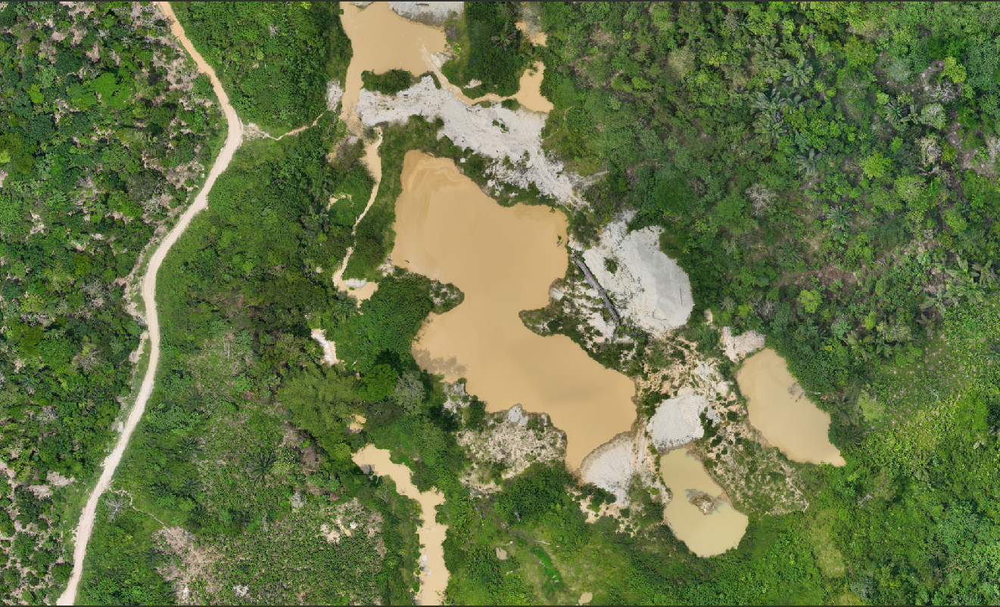
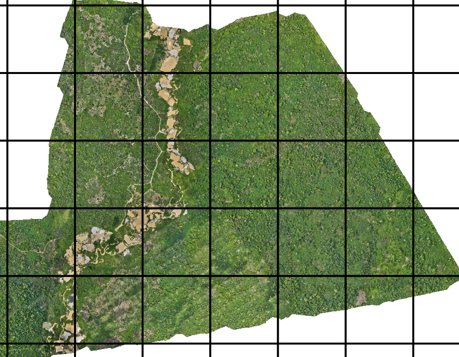
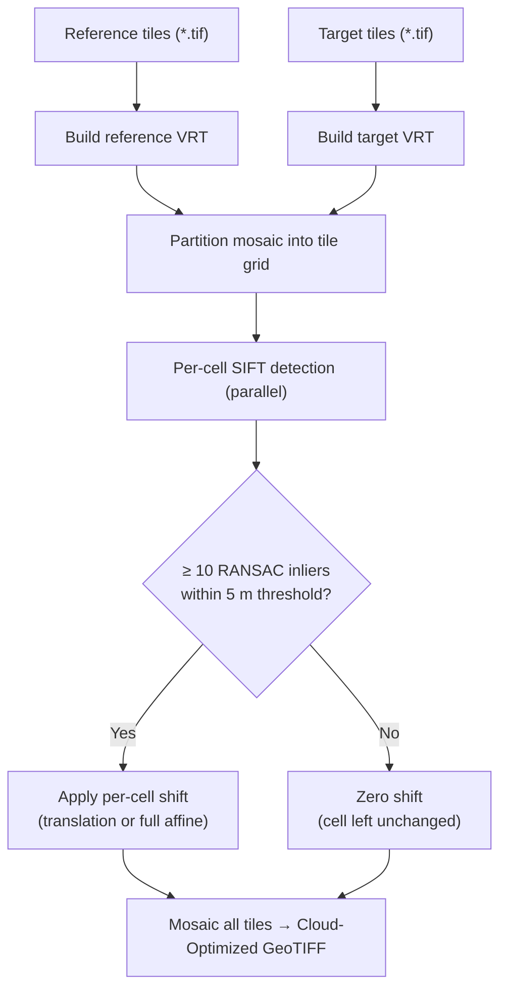

# Drone Image Co-registration Pipeline

A tiled SIFT-based pipeline for aligning multi-temporal drone orthomosaics.  
Built for comparing temporal Drone flights over Bibiani Forest Reserve, Ghana — but applicable to any overlapping drone survey pair.

---

## What is Co-registration?

Drone flights taken at different dates are processed independently, so their orthomosaics often have small spatial offsets caused by GPS error, different flight paths, or varying altitude. Even a 1–2 m offset makes change-detection analysis unreliable.

**Co-registration** aligns the target flight to the reference flight by detecting and correcting these offsets.

| Reference flight | Target flight |
|---|---|
|  |  |

Both flights cover the same mining-impacted forest area in Ghana. Despite appearing visually similar, subtle spatial misalignment between the two acquisitions must be corrected before any temporal change analysis.

---

## Pipeline Overview

The mosaic is partitioned into a regular grid of cells. SIFT detection and matching runs independently on each cell in parallel, then all corrected cells are mosaicked into the final output.





---

## Correction Approaches

Three approaches are provided so results can be compared side-by-side:

| Script | Method | Shift model | Pixel resampling |
|---|---|---|:---:|
| `run_homography_selective.py` | SIFT + RANSAC (8 DOF) | Per-cell translation | No |
| `run_affine_selective.py` | SIFT + RANSAC (4 DOF) | Per-cell translation + rotation + scale | At mosaic |
| `run_arosics_selective.py` | AROSICS NCC | Spatially-interpolated shifts | No (translation) / bilinear (spline) |

**SIFT scripts** — unmatched cells are left at their original position. Use this when you believe unmatched areas are already well-aligned, or where there is no reliable texture for SIFT (e.g. uniform forest canopy).

**AROSICS script** — uses normalised cross-correlation (NCC) instead of SIFT keypoints. It runs on a downsampled copy of the full mosaic to avoid OOM, then interpolates the resulting tie-point table spatially to produce a per-cell (or per-pixel) shift. Two correction modes are available via `AROSICS_CORRECTION` in `config.py`:

- `"translation"` — one constant shift per grid tile; zero pixel resampling; fast
- `"spline"` — thin-plate spline warp applied per-pixel inside every tile; bilinear resample; recommended when GPS drift varies strongly across the mosaic

---

## Match Visualisation

Running `visualize_matches.py` produces a grid overview and per-cell correspondence images.

### Grid match map

Green cells matched successfully. Red cells had content but not enough texture (e.g. homogeneous canopy). Dark grey cells are no-data / non-overlapping.

After running `visualize_matches.py`, the grid overview is saved to `match_visualizations_<method>/match_map.png`.

### Per-cell correspondence image

Reference (left) vs target (right). **Green lines** = RANSAC inlier correspondences driving the shift. Rejected outliers are not shown — only clean, short, parallel matches survive the displacement filter.


---

## QGIS Verification

Load `matches_affine.gpkg` into QGIS alongside your reference mosaic to verify the detected shifts geographically. Style `match_lines_inliers` as arrows — all lines should be roughly parallel and short (< 5 m) for a valid correction.

The three GeoPackage layers are:

| Layer | Content |
|---|---|
| `match_lines_inliers` | One line per RANSAC inlier — start = reference position, end = target position. All lines should be roughly parallel and < 5 m long for a valid correction. |
| `match_lines_outliers` | Rejected matches — longer, scattered lines showing what RANSAC discarded. |
| `cell_stats` | Grid polygons coloured by `n_inliers` with `dx_map` and `dy_map` attributes. |

---

## Installation

### Linux

Install Miniconda if not already present:
```bash
wget https://repo.anaconda.com/miniconda/Miniconda3-latest-Linux-x86_64.sh
bash Miniconda3-latest-Linux-x86_64.sh
```

Create the environment:
```bash
conda create -n co_reg python=3.12
conda activate co_reg
conda install -c conda-forge rasterio matplotlib numpy tqdm gdal opencv scipy
pip install arosics          # required for run_arosics_selective.py
```

### Windows

1. Download and install Miniconda: https://repo.anaconda.com/miniconda/Miniconda3-latest-Windows-x86_64.exe
2. Open **Anaconda Prompt**
3. Create the environment:

```
conda create -n co_reg python=3.12
conda activate co_reg
conda install -c conda-forge rasterio matplotlib numpy tqdm gdal opencv scipy
pip install arosics
```

> `arosics` and `scipy` are only required if you intend to run `run_arosics_selective.py`. The SIFT scripts work without them.

---

## Project Structure

```
image_coregistration/
├── config.py                    ← Edit this first — set your data paths and parameters
│
├── run_homography_selective.py  # SIFT homography correction  (zero shift for unmatched cells)
├── run_affine_selective.py      # SIFT affine correction      (zero shift for unmatched cells)
├── run_arosics_selective.py     # AROSICS NCC correction      (translation or spline warp)
│
├── visualize_matches.py         # SIFT match visualiser — PNG per cell + GeoPackage for QGIS
├── evaluate.py                  # NCC / SSIM / residual-shift comparison across all outputs
├── remosaic.py                  # Re-run mosaic step on existing corrected tiles
│
├── coregistration_utils.py      # Shared utilities (VRT building, tile I/O, mosaic)
├── conceptual_assets/           # Screenshots for this README
├── README.md
└── Install.md
```

---

## Configuration

Open **`config.py`** — this is the only file to edit before running:

```python
# ── Data paths ─────────────────────────────────────────────────────────────────
REFERENCE_GLOB = r"path/to/reference/tiles/*.tif"
TARGET_GLOB    = r"path/to/target/tiles/*.tif"

# ── Tiling and detection ────────────────────────────────────────────────────────
TILE_PX      = 8192   # grid cell size in pixels
DETECT_PX    = 2048   # SIFT detection resolution (smaller = faster, less memory)
BAND         = 1      # band used for SIFT / AROSICS (1 = Red for RGBA drone imagery)
N_CPUS       = 4      # parallel workers

# ── Quality filters (SIFT scripts only) ────────────────────────────────────────
MAD_K        = 3.0    # cells with shift > MAD_K × MAD from consensus are excluded
MAX_SHIFT_PX = 20     # per-match displacement limit in detection pixels (≈ 5 m)

# ── AROSICS settings (run_arosics_selective.py only) ───────────────────────────
AROSICS_GRID_RES      = 200           # tie-point grid spacing in pixels (downsampled input)
AROSICS_WIN_SIZE      = (512, 512)    # NCC matching window (cols, rows) in pixels
AROSICS_MAX_SHIFT     = 50            # maximum expected shift in pixels
AROSICS_MAX_PX        = 4096          # mosaic is downsampled to this size for AROSICS
AROSICS_CORRECTION    = "translation" # "translation" (fast, zero resample) or
                                      # "spline" (per-pixel warp, bilinear resample)
AROSICS_SPLINE_EVAL_N = 16            # coarse grid size for spline evaluation per tile
```

Each run script also has its own `OUTPUT` directory name at the top, which you can leave as-is.

---

## Usage

### Step 1 — Run co-registration

```bash
conda activate co_reg
```

Run a single approach:
```
python run_affine_selective.py
```

Or chain all three:
```
python run_homography_selective.py && python run_affine_selective.py && python run_arosics_selective.py
```

Each script produces:
```
coregistration_output_<method>/
├── corrected_tiles/        # per-cell corrected GeoTIFFs
├── _reference_mosaic.vrt
├── _target_mosaic.vrt
└── coregistered_final.tif  # final Cloud-Optimized GeoTIFF
```

The AROSICS script also writes two intermediate downsampled GeoTIFFs (`_ref_arosics.tif`, `_tgt_arosics.tif`) during shift detection, which are deleted automatically once the tie-point table is built.

### Step 2 — Visualise matches

```
python visualize_matches.py
```

Set `METHOD = "homography"` or `"affine"` at the top. Outputs to `match_visualizations_<method>/`:

- `match_map.png` — grid overview coloured by inlier count
- `match_<row>_<col>.png` — per-cell side-by-side correspondence image
- `matches_<method>.gpkg` — GeoPackage with three layers for QGIS

### Step 3 — Evaluate quality

```
python evaluate.py
```

Samples 50 random windows across all corrected outputs and reports:

| Metric | Meaning | Better = |
|---|---|---|
| NCC | Normalised Cross-Correlation vs reference | Closer to 1.0 |
| SSIM | Structural Similarity vs reference | Closer to 1.0 |
| Residual dRMS | Remaining shift detected after correction | Closer to 0 px |

Results saved to `evaluate_coregistration_results.csv`.

---

## Algorithm Details

### Per-cell detection
1. Read reference and target crops at `DETECT_PX` resolution
2. Histogram-match target to reference (reduces radiometric differences between dates)
3. SIFT keypoint detection (`nfeatures=5000`)
4. FLANN nearest-neighbour matching with Lowe ratio test (threshold 0.75)
5. RANSAC via `findHomography` (8 DOF) or `estimateAffinePartial2D` (4 DOF)
6. **Displacement filter** — discard RANSAC inliers whose keypoint distance exceeds `MAX_SHIFT_PX` detection pixels (~5 m); removes false inliers with long lines
7. Require ≥ 10 surviving inliers to accept the cell

### Outlier rejection (SIFT scripts, per run)
- **MAD filter** — after all cells are processed, cells whose shift is > `MAD_K × MAD` from the median are excluded from the consensus statistics (but still receive their own detected shift)

### Correction (SIFT, zero resampling)
- **Homography** — shifts the tile GeoTransform origin; no pixel resampling
- **Affine** — encodes translation + rotation + scale into the GeoTransform; no per-tile resampling; single resampling at mosaic time via `gdal.Warp`

### AROSICS detection (`run_arosics_selective.py`)
1. Both VRTs are downsampled to `AROSICS_MAX_PX` on the longest edge (avoids the large nodata-mask allocation AROSICS performs at init)
2. `COREG_LOCAL.calculate_spatial_shifts()` runs NCC matching on a regular grid (`AROSICS_GRID_RES` × `AROSICS_GRID_RES` px) using `AROSICS_WIN_SIZE` matching windows
3. AROSICS' own quality filtering (`OUTLIER == False`) keeps only reliable tie points
4. The valid tie-point table is handed to the correction step

### AROSICS correction
- **Translation mode** — scipy `griddata` (linear triangulation) interpolates `X_SHIFT_M` / `Y_SHIFT_M` from tie-point map coordinates to each grid-cell centre; cells outside the tie-point convex hull receive zero shift; shifts are applied as GeoTransform offsets (zero pixel resampling)
- **Spline mode** — an `RBFInterpolator` thin-plate spline is fitted to all valid tie points; evaluated on a coarse `AROSICS_SPLINE_EVAL_N × AROSICS_SPLINE_EVAL_N` grid per tile then upsampled to full resolution with `cv2.resize`; each tile is warped with `cv2.remap` (bilinear); a 64-pixel overlap buffer eliminates seam artefacts at tile boundaries

---

## Output Quality Notes

- `FAILED — cell has no valid pixels` → no-data or non-overlapping area between the two flights
- `FAILED — only N RANSAC inliers` → content present but too little texture for reliable matching (e.g. uniform forest canopy, water)
- A low match rate (10–20%) is normal for dense canopy; unmatched cells are left at their original position
- In QGIS, inlier lines should all be **roughly parallel** and **short (< 5 m)**; long or scattered lines indicate a problem cell
